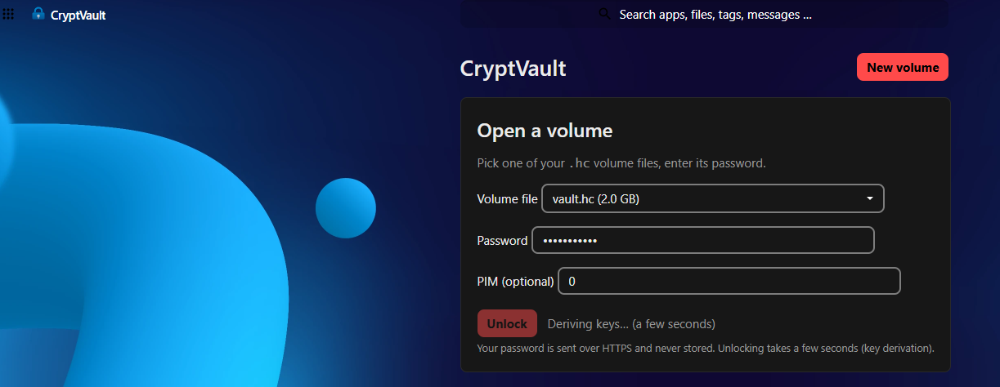
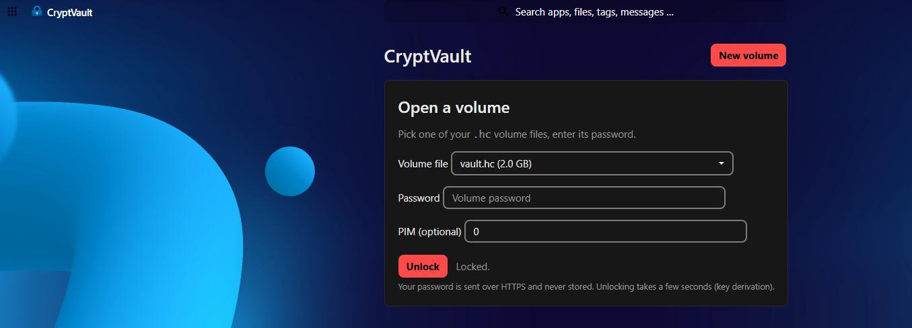
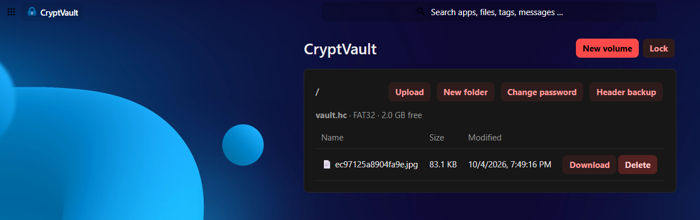

# CryptVault

**Open and manage VeraCrypt-compatible encrypted volumes (`.hc`) directly inside Nextcloud — pure PHP, no binaries, no FUSE, no root required.**

Click a volume file, enter its password, and browse, read, write, and organize the files inside — from the browser, on any device. Installs like any other Nextcloud app.

[](COPYING)
[](https://nextcloud.com)
[](https://php.net)





---

## Features

- **Open existing volumes** — AES-256-XTS volumes created by VeraCrypt. PBKDF2 with SHA-512, SHA-256, Whirlpool, or legacy RIPEMD-160. Custom PIM supported. Hidden-volume headers are probed automatically.
- **Full file manager** — browse, download, upload, create folders, and delete inside FAT12/16/32 and exFAT filesystems.
- **Create volumes** — new AES-256 VeraCrypt-compatible `.hc` files with pure-PHP FAT32 formatting, created directly in your Nextcloud files.
- **Change password** — re-encrypts only the volume header (fast; data untouched).
- **Header backup** — download the encrypted 512-byte volume header for safekeeping.
- **Brute-force protection** — unlock attempts are throttled using Nextcloud's built-in throttler, auto-adapting to your Nextcloud version's API.

## How it works

Everything is implemented from scratch in pure PHP — no VeraCrypt code, no shell commands, no kernel modules:

1. **Unlock** — you pick a `.hc` file and enter its password. The app runs PBKDF2 (500,000 iterations by default, ~1–3 s) over the 512-byte volume header to derive the AES-256-XTS header key. Several KDF/hash combinations are tried automatically, plus custom PIM and hidden-volume header offsets.
2. **Session token** — the derived key is kept in **server memory only** (APCu, never disk, never the database) under a random 256-bit token. Your browser holds the token in memory and sends it over HTTPS with each request. Tokens expire after 30 minutes of inactivity; **Lock** wipes them immediately.
3. **Filesystem access** — sectors are decrypted on the fly with a pure-PHP AES-256-XTS implementation (cross-validated against OpenSSL). Pure-PHP FAT12/16/32 and exFAT drivers translate your clicks into reads/writes against the decrypted sectors. Writes go straight into the `.hc` file.
4. **Stateless fallback** — if the server has no APCu, the app still works: the password is sent with every request (over HTTPS, never stored). Slower, same security guarantees.

## Compatibility

| | Status |
| --- | --- |
| AES-256-XTS | ✅ supported |
| PBKDF2: SHA-512 / SHA-256 / Whirlpool / RIPEMD-160 | ✅ supported |
| Custom PIM | ✅ supported |
| Hidden volume headers | ✅ probed automatically |
| FAT12 / FAT16 / FAT32 read + write | ✅ supported |
| exFAT read + write | ✅ supported |
| Argon2id KDF (VeraCrypt ≥ 1.24 default for *new* volumes) | ❌ not supported |
| Serpent / Twofish / cipher cascades | ❌ not supported |
| Keyfiles | ❌ not supported |
| NTFS inside volumes | ❌ not supported |
| Volumes on S3 / object primary storage | ❌ refused with a clear error (writes would be silently lost) |
| Nextcloud server-side encryption on the `.hc` file | ❌ not supported |

> Volumes created by VeraCrypt 1.26 with **default** settings use AES + SHA-512 + PBKDF2 — fully supported. If VeraCrypt offered you Argon2id during volume creation, go back and choose PBKDF2 (Volume Creation Wizard → Encryption Options), or this app won't be able to open the volume.

**Verified against:** real VeraCrypt 1.26.24 volumes (open, read, write, password change — and real VeraCrypt successfully changed the password on a volume created by this app); `fsck.vfat` + `mtools` for FAT and `fsck.exfat` for exFAT (PHP-written filesystems pass clean); AES-256-XTS cross-checked against OpenSSL over randomized trials.

## Requirements

- Nextcloud 28 – 36, PHP 8.1+
- Standard PHP extensions: `hash`, `json`, `mbstring` (all ship with PHP; `openssl` used where available)
- **Recommended:** `php-apcu` — used as the in-memory token store. Without it the app falls back to stateless mode (password sent per request; works, but slower)
- The `.hc` file must live on **local** Nextcloud storage (the default everywhere, including YunoHost, Proxmox LXC, and Umbrel)

## Installation

### Option A — any Nextcloud server (manual)

1. Copy the `cryptvault` folder into Nextcloud's `apps/` directory, so the path `apps/cryptvault/appinfo/info.xml` exists. Easiest over SFTP — no command-line archive juggling needed.

2. Set ownership to the user your web server / PHP-FPM runs as:

   ```
   chown -R www-data:www-data apps/cryptvault
   ```

   (Check with `ps aux | grep -E 'apache|nginx|php-fpm'` if you're unsure which user that is.)

3. Enable. `occ` must be run as the user that owns `config/config.php` — check with `ls -l config/config.php`:

   ```
   cd /path/to/nextcloud
   sudo -u www-data php occ app:enable cryptvault
   ```

4. Open Nextcloud → **CryptVault** in the top menu.

### Option B — YunoHost

YunoHost's Nextcloud runs PHP-FPM as the **`nextcloud`** user, *not* `www-data`. Every step below uses `nextcloud` deliberately — running `occ` or `chown` as the wrong user is the #1 cause of install failures.

1. Upload the `cryptvault` folder to `/var/www/nextcloud/apps/` (SFTP as root is easiest).
2. Fix ownership:
   ```
   chown -R nextcloud:www-data /var/www/nextcloud/apps/cryptvault
   ```
3. Enable (as the `nextcloud` user — **not** `www-data`, **not** root):
   ```
   cd /var/www/nextcloud
   sudo -u nextcloud php occ app:enable cryptvault
   ```
4. If it reports `cryptvault already enabled` or asks for an upgrade after replacing files with a newer version:
   ```
   sudo -u nextcloud php occ upgrade
   ```
5. Open Nextcloud → **CryptVault** in the top menu.

## Usage

1. Upload a `.hc` file to your Nextcloud Files (or create one in the app with **New volume** — pick a name, size, and password).
2. Open **CryptVault**, select the volume, enter the password (and PIM *only* if the volume was created with a custom PIM — otherwise leave it at 0), click **Unlock**.
3. Browse folders, download files, upload new ones, create folders, delete files.
4. **Change password** and **Header backup** are in the browser toolbar.
5. Click **Lock** when done (idle tokens expire automatically after 30 minutes).

> **PIM** (Personal Iterations Multiplier) controls how many key-derivation rounds protect the password. Leave it at 0 unless you set a custom PIM in VeraCrypt when creating the volume — with the wrong PIM, even the correct password fails.

## Security model

- Passwords are **never stored** — not in the database, not in the PHP session (which lives on disk), not in logs.
- Header keys live in **server memory only** (APCu), under random 256-bit bearer tokens, expiring after 30 minutes idle. Locking wipes them.
- The token is a bearer token: anyone holding it can access the volume until it expires. Guard your Nextcloud session accordingly.
- Don't open the same volume for writing in two sessions at once (same rule as VeraCrypt itself).
- This is a from-scratch reimplementation of the VeraCrypt volume format for convenience, not a certified cryptographic product. For maximum assurance, verify important volumes with real VeraCrypt.

## Troubleshooting

### `Cannot write into "config" directory!` when running `occ`

You're running `occ` as the wrong user. Check who owns the config and match it:

```
ls -l config/config.php
```

Then re-run `occ` as that user (on YunoHost that's always `nextcloud`; on stock installs it's usually `www-data`).

### `Console has to be executed with the user that owns the file config/config.php`

Same root cause as above, from the other direction: you ran `occ` as the web user but `config.php` is owned by someone else (e.g. root). Either fix the ownership or run `occ` as the owner.

### `Your data directory is invalid … Ensure there is a file called ".ncdata" …`

`occ` is being run as a user that can't see the data directory. On YunoHost it lives at `/home/yunohost.app/nextcloud/data/`, readable only by the `nextcloud` user. Re-run `occ` with `sudo -u nextcloud`.

### `App "CryptVault" cannot be installed because it is not compatible with this version of the server`

Your Nextcloud is newer than the app's declared `max-version` in `appinfo/info.xml`. Either update the app to a release that supports your version, or (if you're comfortable) raise `max-version` yourself and re-run `occ upgrade`. The app's version-sensitive calls (brute-force throttler, etc.) auto-adapt to the running Nextcloud.

### Unlock fails with HTTP 500 / a PHP error after upgrading the app files

PHP-FPM caches compiled files (OPcache) and may still run the old code after you replace the app. Restart PHP-FPM:

```
systemctl restart php$(php -r 'echo PHP_MAJOR_VERSION.".".PHP_MINOR_VERSION;')-fpm
```

Also hard-refresh the CryptVault page in your browser (Ctrl+Shift+R) so the new JavaScript loads.

### `Wrong password` on a volume you *know* the password for

- If the volume was created with a **custom PIM**, enter the same PIM.
- If VeraCrypt used **Argon2id** (default for new volumes since 1.24), **Serpent/Twofish/cascades**, or a **keyfile**, the volume is unsupported — see the compatibility table.
- If the `.hc` is on S3/object storage or Nextcloud server-side encryption is enabled for it, it can't be opened.

### Unlock is slow

Key derivation is intentionally expensive (~1–3 s). Browsing slowness afterwards usually means APCu is missing — install `php-apcu` and restart PHP-FPM.

## Developing / building

The repo *is* the app — clone it straight into `nextcloud/apps/`:

```
git clone https://github.com/DanversKara/cryptvault.git /var/www/nextcloud/apps/cryptvault
```

Layout: `lib/Crypto/` (volume format, XTS), `lib/Fs/` (FAT, exFAT), `lib/Service/` (unlock/session logic), `lib/Controller/` (page + API), `js/`, `css/`, `templates/`, `appinfo/`.

To cut a release zip (what users download):

```
zip -r cryptvault-1.0.4.zip cryptvault -x 'cryptvault/.git/*'
```

## License

AGPL-3.0-or-later. See [COPYING](COPYING). Built from scratch — no code from any existing VeraCrypt/Nextcloud integration.

## Trademark notice

VeraCrypt is a trademark of IDRIX. CryptVault is an independent project, not affiliated with or endorsed by IDRIX. "VeraCrypt-compatible" is used descriptively to indicate the volume format this app can read and write.
